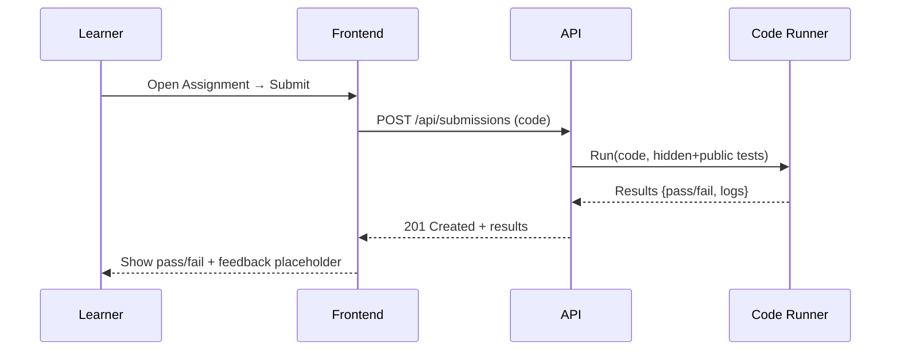
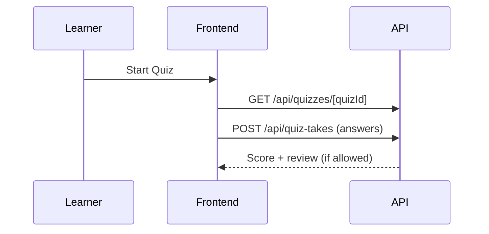

# Core Flows

## A) Submit Code Flow

```mermaid
sequenceDiagram
  participant L as Learner
  participant FE as Frontend
  participant API as API
  participant RUN as Code Runner
  L->>FE: Open Assignment → Submit
  FE->>API: POST /api/submissions (code)
  API->>RUN: Run(code, hidden+public tests)
  RUN-->>API: Results {pass/fail, logs}
  API-->>FE: 201 Created + results
  FE-->>L: Show pass/fail + feedback placeholder
```

## B) Take Quiz Flow

```mermaid
sequenceDiagram
  participant L as Learner
  participant FE as Frontend
  participant API as API
  L->>FE: Start Quiz
  FE->>API: GET /api/quizzes/[quizId]
  FE->>API: POST /api/quiz-takes (answers)
  API-->>FE: Score + review (if allowed)
```
